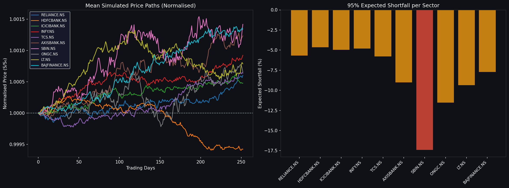

<div align="center">
  <h1>📈 Systemic Risk Engine</h1>
  <p><strong>Regime-Switching Contagion & Monte Carlo Simulation for Equity Markets</strong></p>
</div>

<br>

A research-grade Python pipeline designed to analyze and simulate systemic risk and contagion within the Indian equity market. By combining **Hidden Markov Models (HMM)**, **Network Theory**, **Natural Language Processing (FinBERT)**, and **Contagion-Amplified Monte Carlo Simulations**, this engine provides a dynamic, state-of-the-art approach to forecasting extreme market downturns ("tail risk").

---

## 🚀 Features & Pipeline Architecture

The engine runs a sequential daily simulation pipeline over a 252-day trading year (for 5,000 parallel paths) evaluating 10 major Indian equities across diverse sectors.

1. **Market Regime Detection (HMM)**
   Uses a 3-state Gaussian Hidden Markov Model on historical log returns to classify the current market environment as either **Bull**, **Bear**, or **Crisis**.
2. **Correlation Network Generation**
   Builds a dynamic correlation graph over a 60-day rolling window to identify highly interconnected "central" stocks that pose the greatest systemic risk if they crash.
3. **Sentiment Analysis (FinBERT)**
   Scrapes recent financial headlines and runs them through a transformer-based NLP model to generate a bullish/bearish aggregate tone, which alters the expected drift ($\mu$) and volatility ($\sigma$) in the fundamental simulation math.
4. **Contagion-Adjusted Monte Carlo**
   Simulates 5,000 future price paths using Geometric Brownian Motion (GBM). If a severe negative statistical event occurs on specific stock paths, a mathematically constructed domino effect (contagion) spikes the volatility of highly correlated neighboring stocks on the network graph.
5. **Advanced Risk Metrics**
   Extracts standard and portfolio-level risk measures from the simulated terminal paths, including **95% Value at Risk (VaR)**, **Expected Shortfall (ES)**, and the probability of a multi-sector **Systemic Crash**.

---

## 🧩 Detailed Function Breakdown (`main.py`)

Here is a step-by-step breakdown of every major function driving the risk engine within `main.py`:

- **`load_data(cfg: dict) -> tuple`**  
  Connects to the Yahoo Finance API (`yfinance`) to fetch daily historical pricing for the 10 core equities. Converts closing prices into pure logarithmic returns to feed the models.
  
- **`detect_regime(returns: pd.DataFrame, cfg: dict) -> dict`**  
  Initializes and fits a 3-state Gaussian Hidden Markov Model (using `hmmlearn`). It analyzes the volatility and drift of recent returns to statistically classify whether the market is currently in a *Bull*, *Bear*, or *Crisis* state.

- **`build_network(returns: pd.DataFrame, cfg: dict) -> dict`**  
  Uses the last 60 trading days (rolling window) to generate a correlation matrix. It converts strong correlations into a bidirectional mathematical graph using `networkx`, evaluating 'Eigenvector Centrality' to locate systematically dangerous stocks.

- **`compute_sentiment(headlines: list[str], cfg: dict) -> dict`**  
  Passes raw financial text/headlines into `ProsusAI/finbert` (a Hugging Face NLP model). Returns a normalized sentiment score between `-1.0` and `+1.0`, alongside a textual tone (Bullish/Bearish/Neutral).

- **`adjust_parameters(returns: pd.DataFrame, sentiment_score: float, regime_result: dict, cfg: dict) -> dict`**  
  The mathematical bridge of the engine. It takes historical drift and volatility, boosting drift based on positive sentiment, scaling up volatility based on extreme sentiment, and applying a massive stress multiplier if the HMM detects a Crisis.

- **`run_simulation(S0: np.ndarray, params: dict, network_result: dict, cfg: dict) -> tuple`**  
  The core Monte Carlo engine. It runs 5,000 randomized scenarios. At every simulated step, if a stock path mathematically "crashes" (negative z-score below a threshold), it actively queries the Correlation Graph (from `build_network`) to explosively boost the volatility of connected assets, propagating the shock.

- **`compute_risk_metrics(paths: np.ndarray, S0: np.ndarray, cfg: dict) -> dict`**  
  Evaluates the 5,000 terminal paths to generate institutional risk metrics. It computes the 95% Confidence Value at Risk (VaR), Expected Shortfall (ES), and the joint probability of a multi-sector systemic crash.

- **`plot_dashboard(...)`**  
  A styling and rendering engine powered by `matplotlib`. Transforms the raw statistical outputs and price paths into the dark-themed visual summary image.

- **`main(headlines: list[str], cfg: dict) -> dict`**  
  The primary orchestrator. Dictates the exact sequence of execution, dynamically passing outputs from Stage 1 into Stage 2, handles error catching, and beautifully prints the final structured summary to the terminal.

---

## 📊 Dashboard & Visualization

Upon a successful pipeline execution, the engine spits out numerical metrics and automatically generates a visual dashboard (`simulation_dashboard.png`) summarizing the normalized expected price paths and the Expected Shortfall per sector.



---

## 🛠️ Usage & Installation

This project is built and officially supported via **Docker**, avoiding dependency conflicts (especially involving `torch`, `yfinance`, and `hmmlearn`).

### Prerequisites
- [Docker](https://docs.docker.com/get-docker/) installed on your machine.
- [Docker Compose](https://docs.docker.com/compose/) installed.
- Git (for cloning the repository).

### 1. Fork and Clone
If you want to modify the code on your local system, first Fork the repository on GitHub, then clone it to your machine:
```bash
git clone https://github.com/YOUR_USERNAME/Regime-switching-Monte-Carlo-Simulation.git
cd Regime-switching-Monte-Carlo-Simulation
```

### 2. Running via Docker (Recommended)
You do not need to manage a Python virtual environment. We use Docker Compose profiles to run specific parts of the project.

To run the **main pipeline** (downloads data, detects regime, scores sentiment, runs the Monte Carlo, and outputs the graph):
```bash
docker-compose --profile pipeline up --build
```

**Other available profiles:**
- Run Unit Tests:
  ```bash
  docker-compose --profile test up --build
  ```
- Open an interactive shell inside the container for debugging:
  ```bash
  docker-compose --profile shell run --rm shell
  ```

*(Note: The first time you run this, Docker will download the `ProsusAI/finbert` HuggingFace model. A docker volume handles caching the model for sub-sequent fast runs!)*

### 3. Local Installation (Alternative)
If you prefer running it bare-metal, ensure you have Python 3.9+ installed.
```bash
# Create a virtual environment
python -m venv venv
# Activate it (Windows)
venv\Scripts\activate
# Activate it (Mac/Linux)
source venv/bin/activate

# Install requirements
pip install -r requirements.txt

# Run the main orchestrator
python main.py
```

---

## 🤝 Contributing
Contributions, issues, and feature requests are welcome! 
1. Fork the Project
2. Create your Feature Branch (`git checkout -b feature/AmazingFeature`)
3. Commit your Changes (`git commit -m 'Add some AmazingFeature'`)
4. Push to the Branch (`git push origin feature/AmazingFeature`)
5. Open a Pull Request

## 📝 License
This project is covered under the licenses denoted in the `LICENSE` file within this repository.
