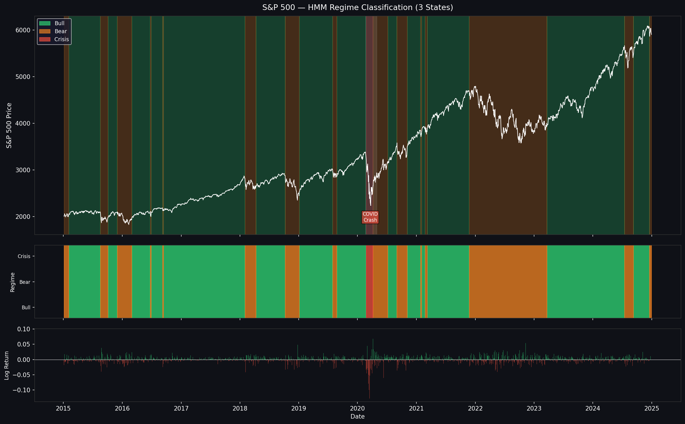
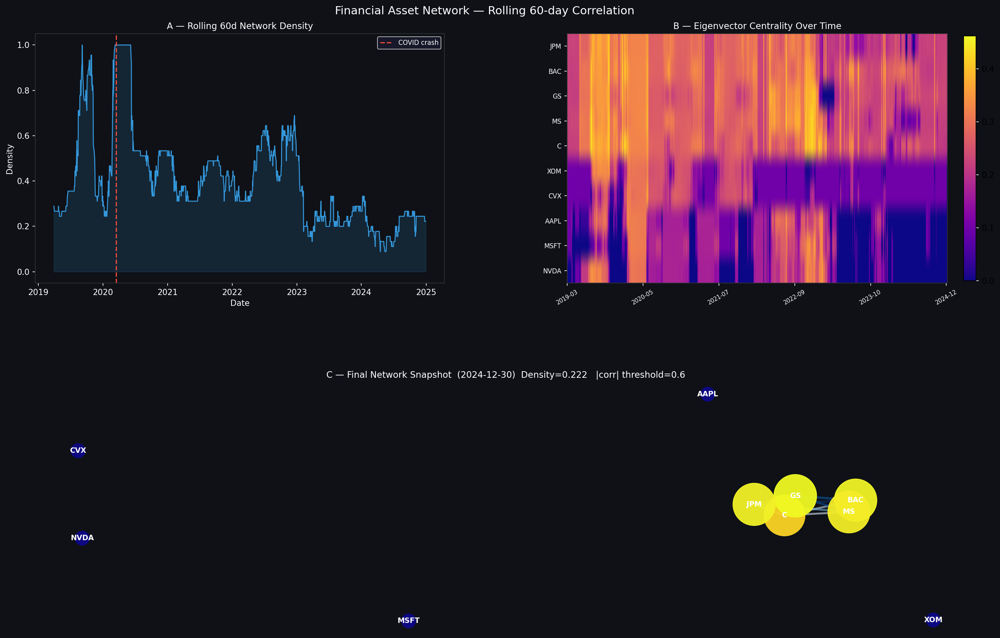
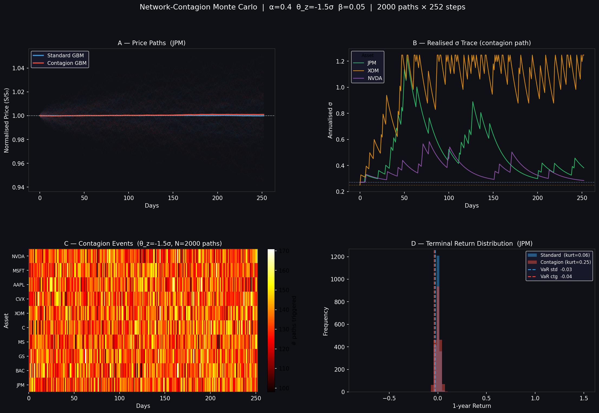

<div align="center">
  <h1>📈 Systemic Risk Engine</h1>
  <p><strong>Regime-Switching Contagion & Monte Carlo Simulation for Equity Markets</strong></p>
</div>

<br>

A research-grade Python pipeline designed to analyze and simulate systemic risk and contagion within the Indian equity market. By combining **Hidden Markov Models (HMM)**, **Network Theory**, **Natural Language Processing (FinBERT)**, and **Contagion-Amplified Monte Carlo Simulations**, this engine provides a dynamic, state-of-the-art approach to forecasting extreme market downturns ("tail risk").

---

## 🚀 Features & Pipeline Architecture

The engine runs a sequential daily simulation pipeline over a 252-day trading year (for 5,000 parallel paths) evaluating 10 major Indian equities across diverse sectors.

1. **Market Regime Detection (HMM)**
   Uses a 3-state Gaussian Hidden Markov Model on historical log returns to classify the current market environment as either **Bull**, **Bear**, or **Crisis**.
   
   

2. **Correlation Network Generation**
   Builds a dynamic correlation graph over a 60-day rolling window to identify highly interconnected "central" stocks that pose the greatest systemic risk if they crash.
   
   

3. **Sentiment Analysis (FinBERT)**
   Scrapes recent financial headlines and runs them through a transformer-based NLP model to generate a bullish/bearish aggregate tone, which alters the expected drift ($\mu$) and volatility ($\sigma$) in the fundamental simulation math.

4. **Contagion-Adjusted Monte Carlo**
   Simulates 5,000 future price paths using Geometric Brownian Motion (GBM). If a severe negative statistical event occurs on specific stock paths, a mathematically constructed domino effect (contagion) spikes the volatility of highly correlated neighboring stocks on the network graph.
   
   

5. **Advanced Risk Metrics**
   Extracts standard and portfolio-level risk measures from the simulated terminal paths, including **95% Value at Risk (VaR)**, **Expected Shortfall (ES)**, and the probability of a multi-sector **Systemic Crash**.

---

## 🧩 Code Architecture (`main.py`)

The `main.py` script serves as the primary orchestrator that sequentially drives the engine. Rather than exploring each function, the execution flow is entirely linear:
1. Fetch asset pricing via `yfinance`.
2. Extract mathematical matrices (HMM variables, Network Centrality, and FinBERT Sentiment scores).
3. Override standard Geometric Brownian Motion variables based on current regimes and sentiment.
4. Force 5,000 contagion-amplified random walks.
5. Generate aggregated risk metrics and output dashboards.

---

## 📊 Dashboard & Visualization

Upon a successful pipeline execution, the engine spits out numerical metrics and automatically generates a visual dashboard (`simulation_dashboard.png`) summarizing the normalized expected price paths and the Expected Shortfall per sector.


---

## 🛠️ Usage & Installation

This project is built and officially supported via **Docker**, avoiding dependency conflicts (especially involving `torch`, `yfinance`, and `hmmlearn`).

### Prerequisites
- [Docker](https://docs.docker.com/get-docker/) installed on your machine.
- [Docker Compose](https://docs.docker.com/compose/) installed.
- Git (for cloning the repository).

### 1. Fork and Clone
If you want to modify the code on your local system, first Fork the repository on GitHub, then clone it to your machine:
```bash
git clone https://github.com/YOUR_USERNAME/Regime-switching-Monte-Carlo-Simulation.git
cd Regime-switching-Monte-Carlo-Simulation
```

### 2. Running via Docker (Recommended)
You do not need to manage a Python virtual environment. We use Docker Compose profiles to run specific parts of the project.

To run the **main pipeline** (downloads data, detects regime, scores sentiment, runs the Monte Carlo, and outputs the graph):
```bash
docker-compose --profile pipeline up --build
```

**Other available profiles:**
- Run Unit Tests:
  ```bash
  docker-compose --profile test up --build
  ```
- Open an interactive shell inside the container for debugging:
  ```bash
  docker-compose --profile shell run --rm shell
  ```

*(Note: The first time you run this, Docker will download the `ProsusAI/finbert` HuggingFace model. A docker volume handles caching the model for sub-sequent fast runs!)*

### 3. Local Installation (Alternative)
If you prefer running it bare-metal, ensure you have Python 3.9+ installed.
```bash
# Create a virtual environment
python -m venv venv
# Activate it (Windows)
venv\Scripts\activate
# Activate it (Mac/Linux)
source venv/bin/activate

# Install requirements
pip install -r requirements.txt

# Run the main orchestrator
python main.py
```

---

## 🤝 Contributing
Contributions, issues, and feature requests are welcome! 
1. Fork the Project
2. Create your Feature Branch (`git checkout -b feature/AmazingFeature`)
3. Commit your Changes (`git commit -m 'Add some AmazingFeature'`)
4. Push to the Branch (`git push origin feature/AmazingFeature`)
5. Open a Pull Request

## 📝 License
This project is covered under the licenses denoted in the `LICENSE` file within this repository.
